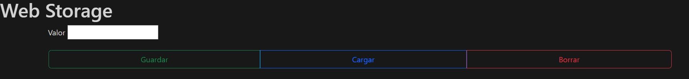
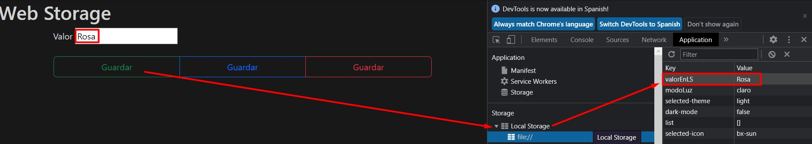
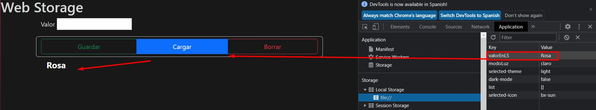
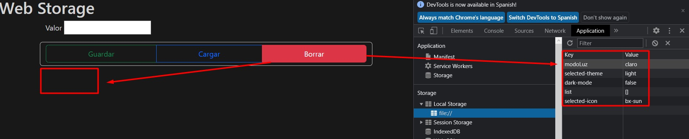
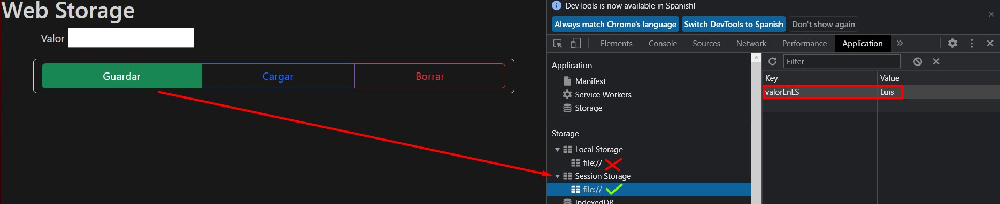

# WebStorage
una simple pagina hecha en HTML, CSS, JavaScript y Bootstrap, la cual nos muestra y enseña el guardado, el almacenamiento, el llamado y 
borrado de datos en "Local Storage" y "Session Storage" de nuestros navegadores Web

  
    
  
    
  
  

## ¿Cuál es el fin de este proyecto?
Es una simple pagina hecha en HTML, CSS, JavaScript y Bootstrap v5.2(para este momento), la cual nos muestra y enseña el guardado, 
el almacenamiento, el llamado y borrado de datos en "Local Storage" y "Session Storage" de nuestros navegadores Web. 
sus fines y objetivos son mero aprendisaje y comprensión del almacenado de datos en nuestros navegadores.

## ¿Puedo Probarlo en Linea? 
Si, Puedes probarlo en linea haciendo click [aqui](https://carlosorellana00.github.io/WebStorage/)

## ¿Cómo puedo probarlo de manera local en mi equipo?
Puede copiarse directamente el código en un archivo HTML, decargar el repositorio o por archivo Zip. 
Este proyecto si bien contiene CSS, JavaScript y Bootstrap. no necesita un gran repositorio, por que es un solo archivo HTML, no necesita mas que un navegador
para correr e interpretarse.

## Modo de uso
para entender mejor el modo de uso de este sensillo programa debemos de abrir y/o ejecutar el archivo "index.html" y proceder a abrir "inspecionar Elemento" dentro 
de la vista en donde se este ejecutando nuestro HTML de "WebStorage". 
Dentro de lo que es Inspector de Elementos y nos dirigimos a la vista de "Application" o "Aplicación", en donde podremos encontrar "Storage" o "Almacenamiento", ya con esto
podremos ver y entender las acciones en vivo de nuestro programa.

# Guardar
Una ves hecho ya los pasos anteriores, procedemos a ingresar un nombre, numero, o valor escrito para ser guardado por memoria, en este caso sera el nombre "Rosa".
al darle al botón "Guardar" y podremos ver por pantalla en "Local Storage" dentro de una tabla que nos proporciona la vista.
En este caso la llave o key es "valorEnLS" (valor en Local Storage) y si valor es "Rosa", el nombre que ingresamos previamente.

  

# Cargar 
Ya pudiendo ver que se nos pudo crear una variable que se guarda en el Local Storage, ahora procedemos a llamarla, en este caso con el Botón de Cargar.
para realizar el llamado, solo presionamos el botón previamente nombrado y podremos obserbar como es que llama al nombre "Rosa", que teniamos gurdado en la memoria del
Local Storage.

  

# Borrar
Bien, ahora que hemos podido ver que que es posible guardar en memoria y llamarla ¿ que pasa si queremos borrarlo?.
Podemos Borrar los datos guardados en memoria mediante el uso del Botón "Borrar", el cual nos permitira borrar lo datos almacenados. 

  

# Puntos a Tener en cuenta al querer borrar:
Para borrar solo el dato que estamos guardando, debemos de usar el comando que se encuentra en la linea de código N°58, el cual es 'removeItem("valorEnLS");', por 
el contrario, en caso de querer borrar toda la información almacenada, debemos de usar el comando 'removeItem.clear;' tal y como se encuentra comentado en la linea N°60 

# PUNTO FINAL A TENER EN CUENTA:
El Ptoyecto esta configurado para actuar ahora en el "Session Storage", no en el "Local Storage", esto para que actue sobre la Sesión.
Si desea actuar sobre el Local Storage y no sobre el Session Storage, lo que se debe de hacer es editar el código de la siguiente manera. la cual es editando
los "sessionStorage" que se encuentran en el area de JavaScript de nuestro código(a partir de la linea 42), por "localStorage", de esa manera trabajara sobre 
Local Storage y no sobre Session Storage. cabe aclarar que en si son las unicas variables que se cambian, esto para no crear 2 isntancias de la aplicacion que se
dividan entre Local y Session, pero que sin embargo si se quisiese hacer, serian practicamente iguales, con unos cambios minimos. 

  

# ¿De que nos puede servir esta aplicación?
El uso de esta aplicación nos ayuda a entender el almacenamiento de datos en nuestros navegadores, y como esto nos puede ayudar a crear aspectos 
como sesiones o instancias en apliaciones como lo pueden ser redes sociales, juegos, sistemas de gestion, etc.

## Referencias y Agradecimientos a: 
- [Autor Original -> Informática DP](https://www.youtube.com/c/InformáticaDP)
- [Video Original -> Web Storage - Local y Session con JS](https://www.youtube.com/watch?v=ctwLRtLy5cs)
